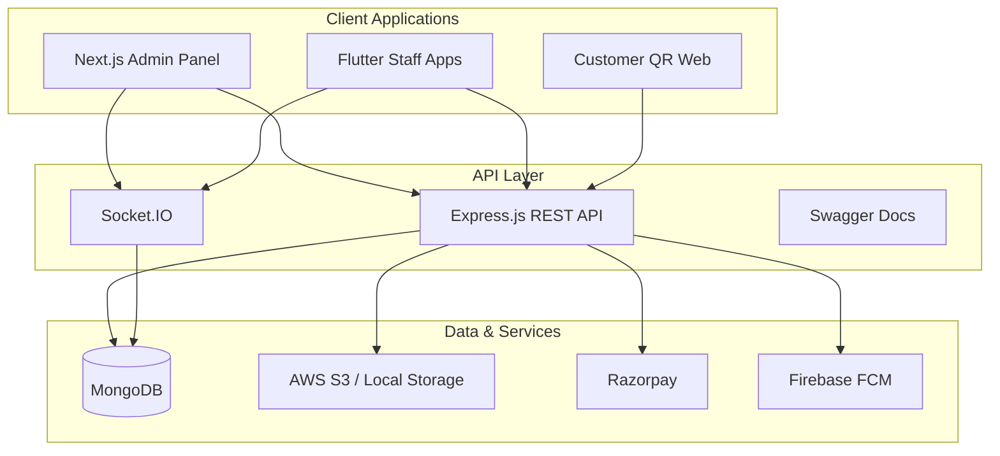
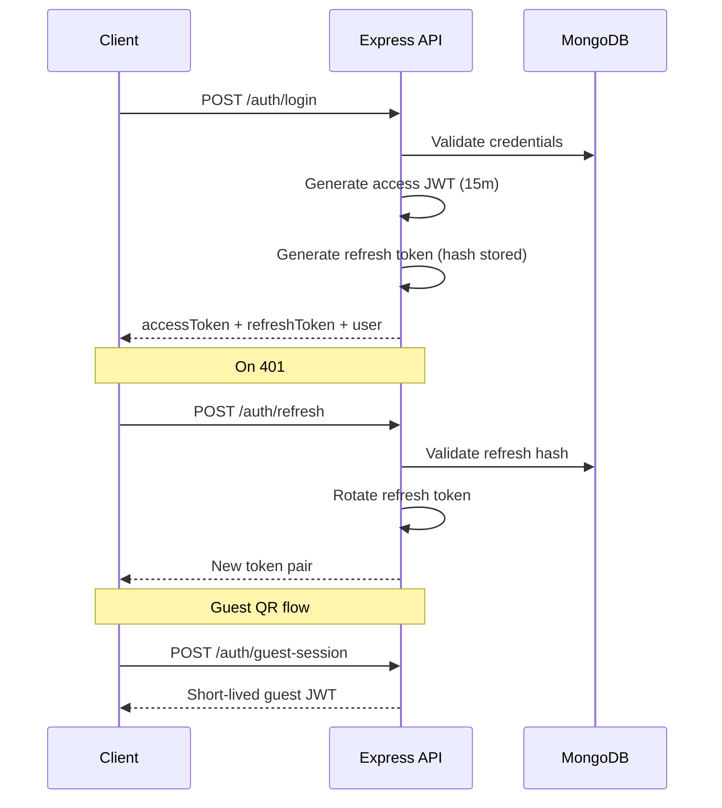
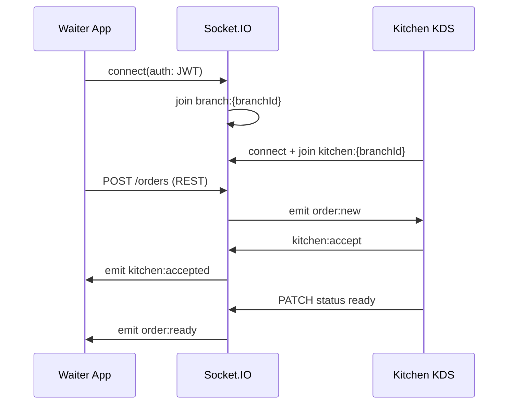

# TechSan Restaurant – System Architecture

## 1. High-Level Architecture



## 2. Folder Structure

### Backend (`apps/backend`)

```
src/
├── config/         # env, database, swagger
├── constants/      # roles, permissions
├── models/         # Mongoose schemas (22 collections)
├── services/       # Business logic layer
├── controllers/    # HTTP handlers
├── routes/v1/      # Versioned REST routes
├── middlewares/    # auth, validate, errors
├── validators/     # Joi DTOs
├── sockets/        # Socket.IO handlers
├── utils/          # logger, pagination, errors
└── scripts/        # seed, migrations
```

**Patterns:** Repository-style services, DTO validation (Joi), global error handler, soft deletes, indexed queries, pagination.

### Admin (`apps/admin`)

```
src/
├── app/            # Next.js App Router pages
├── components/     # UI components
├── store/          # Redux Toolkit slices
└── lib/            # API client, utils
```

### Mobile (`apps/mobile`)

```
lib/
├── core/           # theme, network, socket
└── features/
    ├── auth/
    ├── waiter/
    ├── kitchen/    # KDS
    └── cashier/
```

## 3. Database Schema Design

| Collection | Purpose | Key Indexes |
|------------|---------|-------------|
| users | Staff & customers | email+restaurantId, role |
| restaurants | Tenant root | slug |
| branches | Multi-branch | restaurantId+code |
| diningareas | Floor zones | branchId |
| tables | Table + QR | branchId+number, qrToken |
| categories | Menu categories | restaurantId, parentId |
| menuitems | Menu items | restaurantId, text search |
| orders | Orders + embedded items | branchId+status, tableId |
| payments | Invoices | orderId, branchId+date |
| inventory | Stock items | branchId+sku |
| suppliers | Vendors | restaurantId |
| purchaseorders | PO tracking | branchId |
| stocktransactions | Audit trail | inventoryId, date |
| employees | HR profiles | userId, branchId+code |
| attendance | Daily attendance | employeeId+date |
| shifts | Shift definitions | branchId |
| payrolls | Monthly payroll | employeeId+month+year |
| leaves | Leave requests | employeeId |
| notifications | In-app alerts | userId+isRead |
| coupons | Discount codes | restaurantId+code |
| taxes | Tax config | restaurantId |
| reservations | Table bookings | branchId+date |
| activitylogs | Audit logs | userId, createdAt |
| membershipplans | Loyalty tiers | restaurantId |
| feedbacks | Customer ratings | orderId |

## 4. Authentication Flow



**Roles:** `super_admin`, `restaurant_admin`, `manager`, `waiter`, `kitchen_staff`, `cashier`, `customer`

**Permissions:** Granular strings (e.g. `order:create`, `payment:process`) mapped per role in `constants/roles.js`.

## 5. Realtime Socket Flow



**Events:**

| Direction | Event | Payload |
|-----------|-------|---------|
| Server → Client | `order:new` | Full order document |
| Server → Client | `order:updated` | Order with status |
| Server → Client | `order:ready` | Order ready for pickup |
| Server → Client | `table:updated` | Table status |
| Server → Client | `table:call_waiter` | Order with flag |
| Server → Client | `table:request_bill` | Order with flag |
| Client → Server | `join:table` | tableId |
| Client → Server | `kitchen:accept` | orderId |

## 6. API Endpoints (v1)

Base: `/api/v1`

### Auth
| Method | Path | Description |
|--------|------|-------------|
| POST | /auth/login | Staff login |
| POST | /auth/refresh | Refresh tokens |
| POST | /auth/logout | Revoke refresh |
| POST | /auth/forgot-password | Send OTP |
| POST | /auth/reset-password | Reset with OTP |
| POST | /auth/guest-session | QR guest JWT |
| GET | /auth/me | Current user |

### Tables
| POST | /tables/areas | Create dining area |
| POST | /tables | Create table + QR |
| GET | /tables | List tables |
| GET | /tables/live | Live monitor |
| GET | /tables/qr/:token | Resolve QR |
| POST | /tables/:id/qr | Regenerate QR |
| POST | /tables/:id/merge | Merge tables |
| POST | /tables/:id/split | Split tables |
| PATCH | /tables/:id/status | Update status |

### Orders
| POST | /orders | Create order |
| GET | /orders | List (paginated) |
| GET | /orders/kitchen | KDS queue |
| GET | /orders/:id | Order detail |
| PATCH | /orders/:id/status | Update status |
| POST | /orders/:id/call-waiter | Call waiter |
| POST | /orders/:id/request-bill | Request bill |

### Menu
| GET | /menu/public/:restaurantId | Public menu (QR) |
| GET/POST | /menu/categories | Categories CRUD |
| GET/POST/PATCH | /menu/items | Items CRUD |

### Payments
| POST | /payments | Process payment |
| POST | /payments/razorpay/order | Create Razorpay order |
| POST | /payments/:id/refund | Refund |

### Reports
| GET | /reports/daily-sales | EOD sales |
| GET | /reports/top-items | Best sellers |
| GET | /reports/peak-hours | Hourly traffic |
| GET | /reports/forecast | AI sales forecast |

### Inventory, Employees, Reservations
See route files in `apps/backend/src/routes/v1/`.

## 7. Security Best Practices

- Helmet, CORS whitelist, rate limiting
- bcrypt (12 rounds) for passwords
- Refresh token rotation + hashed storage
- JWT short expiry (15m access, 7d refresh)
- Joi input validation on all mutations
- RBAC middleware on protected routes
- Soft delete for data retention
- Activity logs for audit trail
- Razorpay signature verification
- No secrets in repository (.env only)
- MongoDB indexes for query performance

## 8. Scalability Recommendations

1. **Horizontal API scaling:** PM2 cluster mode or Kubernetes replicas behind load balancer
2. **Socket.IO:** Redis adapter for multi-instance pub/sub
3. **MongoDB:** Replica set + read replicas for reports
4. **Caching:** Redis for menu, table status, session
5. **CDN:** S3 + CloudFront for menu images
6. **Queue:** Bull/BullMQ for inventory deduction, notifications, payroll
7. **Multi-tenancy:** `restaurantId` on all tenant-scoped collections
8. **Observability:** Winston → ELK/Datadog, health checks at `/api/v1/health`

## 9. UI/UX Guidelines

- **Admin:** Dark sidebar, orange brand accent, card-based dashboard, role-based nav
- **KDS:** Large touch targets, color-coded order cards, sound on `order:new`
- **Waiter:** Grid table map with status colors, quick-add flow
- **QR Menu:** Mobile-first, sticky cart, minimal steps to checkout
- **Accessibility:** 44px min touch targets on tablets, high contrast status badges
